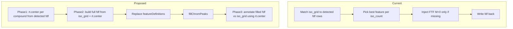

# Refactor `MSIP_annotate_with_iso_grid` (MSIP_note item 11)

## Goal

Change [`MSIP_annotate_with_iso_grid`](R/MSIP-function.R) from **annotating detected features in place** to a **targeted feature-table rebuild** workflow:

1. Discover **`rt.center`** / **`rt.sd`** per compound from existing xcms features (keep current step-5 logic).
2. Build a **new `featureDefinitions`** containing **every** `iso_grid` row for compounds that passed step 1.
3. **Replace** the polarity’s `featureDefinitions` with that table.
4. Run **`xcms::fillChromPeaks`**.
5. **Annotate** the filled object using **`rt.center`** (not compound-table reference RT) for RT matching.

**User decisions (confirmed):**

- Compounds with **no phase-1 hits** → **omit** from constructed fdf.
- **mzmin/mzmax** half-window → use **`mz_ppm`** argument (not hard-coded 5 ppm).

---

## Current vs proposed architecture



---

## Implementation plan

### 1. Split `.annotate_one_polarity` into named phases

Refactor the inner closure (~lines 2887–3250 in [`R/MSIP-function.R`](R/MSIP-function.R)) into helpers (same file, not exported unless useful for tests):

| Helper | Responsibility |
|--------|----------------|
| `.msip_discover_rt_centers(fdf, iso_grid, ...)` | Phase 1 — returns `data.frame` per compound: `compound_id`, `rt_center`, `rt_sd`, `rtmin_mean`, `rtmax_mean`, optional `matched_feature_idx` |
| `.msip_build_fdf_from_iso_grid(iso_grid, rt_centers, compound_table, mz_ppm, ...)` | Phase 2 — one row per `(compound_id, iso_count)` |
| `.msip_annotate_fdf_with_iso_grid(fdf, iso_grid, rt_centers, mz_ppm, rt_tol.reference, rt_tol.isotopologue)` | Phase 3 — post-fill metadata / peak linking |

Keep existing utilities: `.cluster_rt_group`, `.feature_intensity`, `.merge_compound_table_cols`, `.fdf_feature_id_vec`.

### 2. Phase 1 — Discover `rt.center` (preserve step 5 logic)

**Extract** the existing per-compound loop (lines 2990–3068) with minimal behavior change:

- For each `compound_id` in `iso_grid`:
  - Match all iso_grid rows to `fdf` by **m/z** (`mz_ppm`) and **reference RT** (`iso_grid$rt`, `rt_tol.reference`).
  - Cluster hit `rtmed` with `rt_tol.isotopologue`.
  - Pick RT group with **max summed intensity**.
  - Record:
    - `rt_center` = `mean(rtmed)` of selected group (current)
    - `rt_sd` = `sd(rtmed)` of selected group
    - `rtmin_mean` = `mean(fdf$rtmin[feature_idx in group])`
    - `rtmax_mean` = `mean(fdf$rtmax[feature_idx in group])`
- Apply **existing conflict resolution** (one detected feature → one compound) **before** finalizing centers, so shared peaks don’t bias multiple compounds.
- **Skip compounds** with no hits (`next` — aligns with “skip compound” choice).

**Remove** from phase 1: writing `compound_id` / `iso_count` onto original `fdf`, RT-incoherence guardrail, FTF injection — those move to phase 2/3 or become unnecessary.

Store `rt_centers` in `object@advancedAna$MSIP$temp$rt_centers[[polarity.tag]]` (optional cache for debugging / downstream MSIP).

### 3. Phase 2 — Construct full `fdf` from `iso_grid`

For each row in `iso_grid` whose `compound_id` exists in `rt_centers`:

| Column | Rule |
|--------|------|
| `feature_id` | Stable new ids, e.g. `paste0(compound_id, "_M", iso_count)` or continue `FT####` / `FTF####` scheme — **pick one** and document; avoid reusing old xcms feature ids (old table is discarded) |
| `mzmed` | Theoretical `iso_grid$mz` |
| `mzmin` / `mzmax` | `mzmed ± mzmed * mz_ppm / 1e6` |
| `rtmed` | `rt_center` for that compound |
| `rtmin` / `rtmax` | `rtmin_mean` / `rtmax_mean` from phase 1 (fallback: `rt_center ± rt_tol.reference` if means non-finite) |
| `compound_id`, `name`, `iso_count`, `iso_form`, `adduct` | From `iso_grid` |
| `isotopologue_rt_center`, `isotopologue_rt_sd` | From `rt_centers` |
| `peakidx` | `list(integer(0))` initially |
| `npeaks` | `0L` initially |
| `peakMaxo` | `0` or `NA` until fill |

- **Include all isotopologues** in `iso_grid` for retained compounds (not only those that matched in phase 1).
- Merge **`compound_table`** extra columns via `.merge_compound_table_cols`.
- Set **`iso_seed`** on all rows of a compound to the **M+0** row’s `feature_id` (always present in constructed table).

**Delete** the current FTF-only injection block (lines 3153–3233) — M+0 is always a row in the new table.

### 4. Replace `featureDefinitions` and run `fillChromPeaks`

```r
xcms::featureDefinitions(xcms.xcms) <- S4Vectors::DataFrame(fdf_new)
xcms.xcms <- xcms::fillChromPeaks(
  xcms.xcms,
  param = xcms::FillChromPeaksParam()  # same as xcmsProcessingMS1
)
```

**Prerequisites / risks:**

- **`chromPeaks`** from prior `xcmsProcessingMS1` / `groupChromPeaks` must remain on the object (only `featureDefinitions` is replaced).
- `fillChromPeaks` **appends** a “Peak filling” entry to `@.processHistory` (expected).
- `featureDefinitions<-` alone does **not** clear process history (per prior audit).
- After replace, run `validObject(xcms.xcms)` in dev/tests; ensure `peakidx` / `npeaks` update correctly post-fill.

**Pipeline note:** [`MSIP_xcms_processing.targeted`](R/MSIP-function.R) already calls `xcmsProcessingMS1` → `fillChromPeaks` once, then `MSIP_annotate_with_iso_grid`. After this refactor there will be a **second** `fillChromPeaks` — intentional (fill for rebuilt ROIs). Optional follow-up: skip first fill in targeted path to save time (not required for item 11).

Accept optional `BPPARAM` / `fillChromPeaks` param argument on `MSIP_annotate_with_iso_grid` if targeted workflows need parallel fill.

### 5. Phase 3 — Annotate filled object using `rt.center`

After `fillChromPeaks`, re-read `fdf` and:

- Rows already carry compound/isotopologue identity from construction — phase 3 is primarily **validation + peak linkage**, not re-discovery of compound identity.
- **Re-match** filled features to `iso_grid` m/z (`mz_ppm`) with RT reference = **`rt_center`** ± `rt_tol.reference` (not `iso_grid$rt`).
- Update from filled data where appropriate:
  - `peakidx`, `npeaks`, `peakMaxo` (from `featureValues(..., value = "maxo")` pattern used in `MSIP_xcms_processing.targeted` lines 3514–3528)
  - Optional: refine `rtmed` from filled peak medians while keeping `isotopologue_rt_center` fixed
- Re-apply **light conflict check** if fill assigns the same peak to multiple theoretical rows (unlikely if mz windows are tight).

Remove obsolete **RT-incoherence guardrail** (lines 3110–3151) if all rows per compound share the same `rt.center` by construction; keep only if phase 3 matching can reassign rows.

### 6. Update docs and callers

| File | Change |
|------|--------|
| [`R/MSIP-function.R`](R/MSIP-function.R) | Rewrite roxygen for `MSIP_annotate_with_iso_grid` (remove FTF-centric description; document 3-phase flow + `fillChromPeaks`) |
| [`R/MSIP-function.R`](R/MSIP-function.R) | Update stale roxygen on `MSIP_xcms_processing.targeted` (lines 3295–3312 still describe old two-phase M+0 matching) |
| [`vignettes/MSIP_note.md`](vignettes/MSIP_note.md) | Mark item 11 done; note skip-no-hit and `mz_ppm` for mz windows |
| [`NAMESPACE`](NAMESPACE) | Re-document if signature gains `BPPARAM` / `fillParam` |

No change required to export list unless new params are added.

### 7. Testing checklist

Manual / testthat (if test data available):

1. Polarity with hits: `nrow(featureDefinitions)` == `nrow(iso_grid)` for compounds with centers.
2. Compound with no hits: absent from new fdf.
3. All `iso_count` levels present per retained compound.
4. `iso_seed` points to M+0 row for each compound.
5. `length(processHistory(x))` increases by 1 after annotate (fill step).
6. `featureValues` non-NA for filled samples where signal exists.
7. Compare intensities before/after vs old annotate path on one MSdev example object.

---

## Code regions to remove or relocate

| Current block | Action |
|---------------|--------|
| Lines 2950–3108 (annotate onto original fdf) | Replace with phase 1 only (rt centers) |
| Lines 3110–3151 (RT guardrail) | Drop or reduce after phase 3 |
| Lines 3153–3233 (FTF injection) | **Remove** — superseded by full iso_grid fdf |
| Lines 3236–3248 (rbind + write) | Replace with phase 2 write + fill + phase 3 write |

---

## Out of scope (later MSIP_note items)

- Item 7: cross-polarity (POS+NEG) block scoring — still separate.
- Item 8–10: `rda` column renames (`rt.min`, `mz.positive`, etc.) — not part of item 11 unless you want them added during fdf construction.
