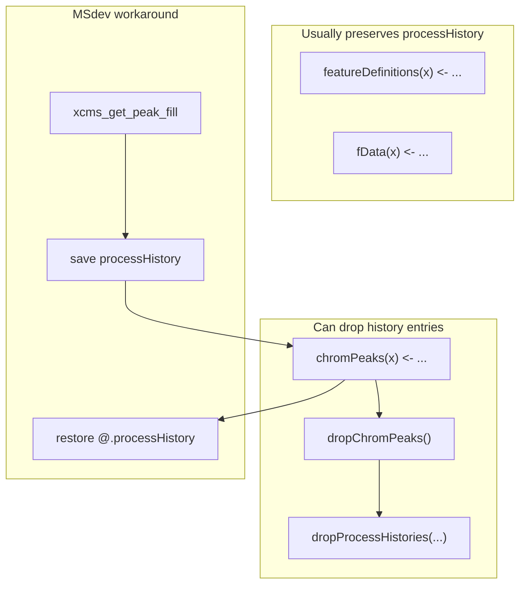

# `xcms_*` functions and `@.processHistory` behavior

## Scope

All functions named `xcms_*` in the repo (27 total):

- 25 in [`R/dev_xcms.R`](R/dev_xcms.R)
- 2 in [`R/DDA-function.R`](R/DDA-function.R)

No other `xcms_*` function definitions were found.

## How xcms treats `@.processHistory`

The slot lives on `XCMSnExp` (not on `MsFeatureData`). MSdev only **explicitly** touches it in one place:

```267:269:R/dev_xcms.R
  xcms.ph <- xcms::processHistory(xcms.xcms)
  xcms::chromPeaks(xcms.xcms) <- xcms.peaks
  xcms.xcms@.processHistory <- xcms.ph
```

That pattern exists because **`chromPeaks<-` is destructive to process history**: in xcms 4.8 it calls `dropChromPeaks()`, which calls `dropProcessHistories()` for:

- Peak detection
- Peak grouping
- Peak filling
- Calibration
- Peak refinement  
- (and sometimes retention-time correction, depending on state)

So “clears history” here means **removes those processing steps from the list**, not necessarily `length(@.processHistory) == 0`.

By contrast, **`featureDefinitions<-` does not call `dropProcessHistories`** (it only swaps `msFeatureData` while copying the environment and setting `featureDefinitions`). **`fData<-`** updates scan metadata only and does not touch `@.processHistory`.



## Summary table

| Function | Modifies `XCMSnExp`? | Clears / drops `@.processHistory`? | Notes |
|----------|---------------------|-------------------------------------|-------|
| `xcms_get_peak_fill` | Yes (`chromPeaks`) | **Triggered, then fully restored** | Only function that re-assigns history after `chromPeaks<-` |
| `xcms_filter_peaks_NA` | Yes (`chromPeaks`) | **Yes (partial drop)** | No restore; same `chromPeaks<-` path as peak fill |
| `xcms_get_feature_group` | Yes (`featureGroups`, `groupFeatures`) | **No** (expected) | Uses `featureDefinitions` / grouping columns; no `chromPeaks<-` |
| `xcms_get_feature_def_stat` | Yes (`featureDefinitions`) | **No** | |
| `xcms_get_feature_val_stat` | Yes (`featureDefinitions`) | **No** | |
| `xcms_get_feature_stat` | Yes (calls def + val stat) | **No** | |
| `xcms_get_feature_isotopologues` | Yes (`featureDefinitions`) | **No** | |
| `xcms_get_feature_isotopologues_multi_tracer` | Yes (`featureDefinitions`) | **No** | |
| `xcms_get_feature_traced_isotopologue` | Yes (`featureDefinitions`) | **No** | Reads via `get_xcms_quantify_MSIP` (returns SE, does not mutate xcms) |
| `xcms_get_feature_isotope_label` | Yes (deprecated wrapper) | **No** | Delegates to `xcms_get_feature_traced_isotopologue` |
| `xcms_get_feature_ms1_candidate` | Yes (`featureDefinitions`) | **No** | |
| `xcms_get_feature_ms2_score` | Yes (`featureDefinitions`) | **No** | |
| `xcms_get_feature_isopattern_score` | Yes (`featureDefinitions`) | **No** | |
| `xcms_get_feature_annotation` | Yes (`featureDefinitions`) | **No** | |
| `xcms_remove_feature_var` | Yes (`featureDefinitions`) | **No** | Drops columns only |
| `xcms_get_scan_Stat` | Yes (`fData`) | **No** | |
| `xcms_get_feature_purity` | Yes (`featureDefinitions`) | **No** | Optional matrix path is read-only on xcms |
| `xcms_from_ms2_spectra` | **Creates new** `XCMSnExp` | **Empty history** | `new("XCMSnExp")` → `length(@.processHistory) == 0` by default; not a “clear” of an existing object |
| `xcms_get_feature_adduct_connection` | **No** | **N/A** | Reads `featureDefinitions`; builds igraph; does not return modified xcms |
| `xcms_get_feature_wmean` | Yes (`featureDefinitions`, updates `mzmed`/`rtmed`) | **No** | |
| `xcms_filter_feature_mz_rsd` | Yes (`featureDefinitions` subset) | **No** | Does not prune `chromPeaks` / `peakidx` |
| `xcms_filter_feature_rt_rsd` | Yes (`featureDefinitions` subset) | **No** | Same caveat as mz filter |
| `xcms_get_dda_scan_stimulate` | Yes (`fData`, `featureDefinitions`) | **No** | Also calls `xcms_get_scan_Stat` first |
| `xcms_get_dda_ms2_assignment` | Yes (`fData`, `featureDefinitions`) | **No** | |

## Grouped by risk

### High risk (history loss via `chromPeaks<-`)

- **`xcms_filter_peaks_NA`** — drops NA/NaN mz peaks; **will remove peak-processing history entries** unless you add the same save/restore pattern as `xcms_get_peak_fill`.
- **`xcms_get_peak_fill`** — same underlying issue, but **history is preserved** by design.

Related non-`xcms_*` helpers in the same pipeline ([`xcmsProcessingMS1`](R/dev_xcms.R) area) also use `chromPeaks<-` (`fix_xcms_chromPeaks_mz_width`, `filter_xcms_chromPeaks_mz_width`) and have the same risk.

### Low risk (metadata / annotation only)

All `xcms_get_feature_*` annotators, filters on `featureDefinitions`, DDA assignment, scan stats, purity, wmean, remove-var — **should keep existing `@.processHistory`**.

Caveat: subsetting `featureDefinitions` without updating `chromPeaks`/`peakidx` can leave **inconsistent** feature–peak links; that is separate from history clearing.

### Special cases

- **`xcms_from_ms2_spectra`**: builds a synthetic `XCMSnExp` with peaks/features but **no processing steps recorded** (empty history). Callers should not expect `processParam()` for CentWave/grouping unless they add history manually (as PAVE does elsewhere in [`R/PAVE.R`](R/PAVE.R)).
- **`xcms_get_feature_adduct_connection`**: exploratory only; **does not modify** the input object.

## Practical recommendation

If you need `MSdev_processInfo()` / `processHistory()` to remain valid after MSdev post-processing:

1. Avoid `chromPeaks<-` without restoring history (only `xcms_get_peak_fill` does this today).
2. Prefer `featureDefinitions<-` paths for annotation and QC columns (safe for history).
3. After `xcms_filter_peaks_NA` (or any future `chromPeaks` edit), either copy the `xcms_get_peak_fill` restore block or re-run/document that peak-processing metadata is intentionally dropped.

## Optional follow-up (not in this audit)

- Add a small internal helper, e.g. `.xcms_preserve_history(x, expr)`, used by all `chromPeaks<-` call sites.
- Empirical test with a real post-`findChromPeaks`/`groupChromPeaks` object: `length(processHistory(x))` before/after each mutating function.
