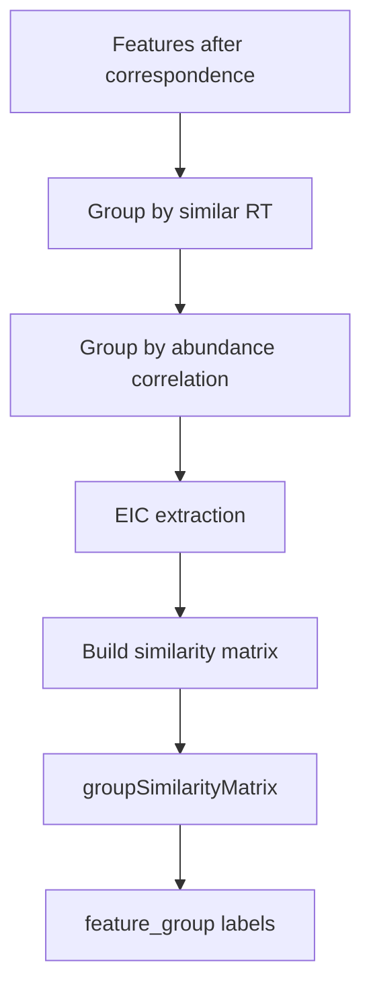
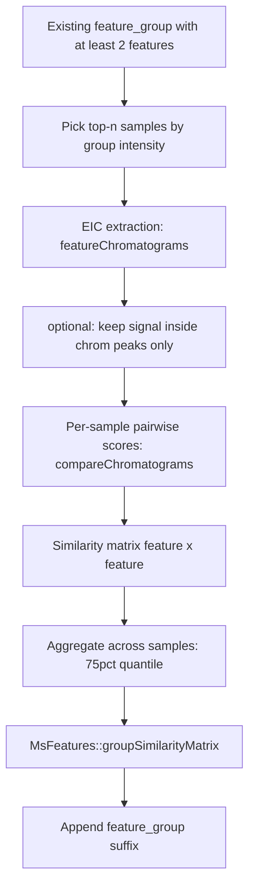
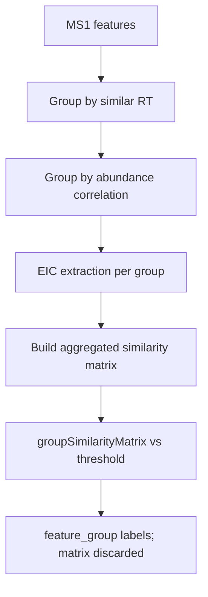
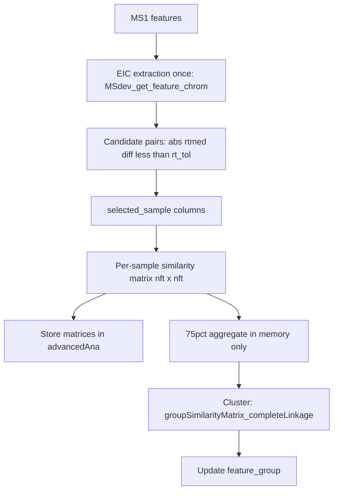

```{r, include = FALSE}
knitr::opts_chunk$set(
  collapse = TRUE,
  comment = "#>",
  eval = FALSE
)
```

This note explains **xcms / MsFeatures feature compounding** (group by RT → abundance correlation → EIC shape), focusing on **EIC extraction** and the **similarity matrix**, and how MSdev’s stock path compares to custom `MSdev_group_feature_EIC()`.

> **API note (xcms ≥ ~4.x / Bioc 3.21+):**  
> `EicSimilarityParam` used to live in **MsFeatures**. It now lives in **xcms**.  
> RT and abundance params remain in MsFeatures; only the EIC constructor moved:
>
> ```r
> # old (broken on current MsFeatures)
> MsFeatures::EicSimilarityParam(...)
>
> # current
> xcms::EicSimilarityParam(...)
> ```
>
> The generic is still `MsFeatures::groupFeatures()`; xcms registers the method for `EicSimilarityParam`.

---

## 1. What problem does this solve?

After peak picking + correspondence, an LC-MS dataset has many **features** (m/z–RT entities). One chemical compound often produces several ions (adducts, isotopes, in-source fragments). Those appear as separate features.

**Compounding / feature grouping** assigns features that likely come from the **same compound** into a shared `feature_group` ID. It does **not** merge intensities; it only labels groups for later annotation / complexity reduction.

Biological assumptions used by the pipeline:

| Assumption | Process step |
|---|---|
| Same-compound ions share retention time | Group by similar RT |
| Their abundances co-vary across samples | Group by abundance correlation |
| Their elution / peak shapes match | Group by EIC shape (extract EICs → similarity matrix → cluster) |

The EIC shape step is the last, most expensive refinement.

---

## 2. xcms feature grouping workflow

Compounding assigns each feature a `feature_group` label. Steps are **incremental**: each stage **refines** (splits) groups already in `featureDefinitions(object)$feature_group` (accessor: `featureGroups()`). IDs become hierarchical:

```text
FG.004          # after RT proximity grouping
FG.004.002      # after abundance correlation
FG.004.002.001  # after EIC shape correlation
```

Overall pipeline (EIC stage expanded so extraction → similarity matrix → clustering are visible):



Same chain inside the EIC stage, with more detail:



Features with `feature_group = NA` are **skipped** by later steps.

### 2.1 Group by similar retention time

**What it does:** put features with close median RTs into the same group (same-compound ions should co-elute).

- Cheap first pass over all features.
- Input: `rtmed` (and optional existing groups).
- Output: large RT-proximal clusters (false positives OK — later steps split them).
- API (optional): `MsFeatures::SimilarRtimeParam(diffRt)`. MSdev maps this to `diffRt` in `xcms_get_feature_group()`.

### 2.2 Group by abundance correlation

**What it does:** within each current group, correlate feature abundance vectors across samples (`featureValues`). Keep pairs with correlation ≥ a threshold.

- Uses intensity patterns across the experiment (often log2-transformed; gap-filled values optional).
- Output: RT groups split into abundance-coherent sub-groups.
- API (optional): `MsFeatures::AbundanceSimilarityParam`. MSdev maps this to `intCor`.

### 2.3 Group by EIC shape (detail)

**What it does:** within each **existing** feature group, extract EICs, build a feature×feature **similarity matrix**, then call **`MsFeatures::groupSimilarityMatrix`** to split groups by peak-shape similarity.

| Step | What happens | Note |
|---|---|---|
| Sample selection | Rank samples by sum of feature intensities in the group; take top `n` | Avoids noisy low-signal chromatograms |
| **EIC extraction** | `featureChromatograms()` for candidate features in those samples | Dominant cost; raw files must be readable |
| Peak mask | If `onlyPeak = TRUE`, drop intensities outside chrom peaks | Reduces baseline noise |
| Pairwise scores | `compareChromatograms` (`alignRt` + `cor` by default) **per sample** | One score per feature pair per sample |
| **Similarity matrix** | `nft × nft` matrix of those scores (per sample, then aggregated) | **Not stored** by xcms — built, passed to clustering, discarded |
| Aggregate | 75% quantile of sample-wise scores per pair | Single matrix for `groupSimilarityMatrix` |
| **`groupSimilarityMatrix`** | `MsFeatures::groupSimilarityMatrix(sim, threshold)` | Default `groupFun` of `EicSimilarityParam`; links pairs with score ≥ `threshold` |
| Labels | Hierarchical rename (`FG.xxx.yyy.001`, …) | Singletons get `.001` without correlation |

API (optional): `xcms::EicSimilarityParam` (constructor moved out of MsFeatures; default `groupFun = groupSimilarityMatrix`). MSdev stock path: `eicCor` in `xcms_get_feature_group()` with `n = 2`.

```{r}
groupFeatures(x, xcms::EicSimilarityParam(threshold = 0.7, n = 2))
# internally: ... -> similarity matrix -> MsFeatures::groupSimilarityMatrix(sim, threshold)
```

### 2.4 Why this order?

1. RT first — cheap, necessary co-elution constraint.
2. Abundance next — splits co-eluting but unrelated ions when sample variance allows.
3. EIC last — extraction + similarity matrix + `groupSimilarityMatrix` are expensive; only run inside already-reduced groups.

---

## 3. MSdev workflows compared

MSdev exposes **two** paths:

| Path | Function | Role |
|---|---|---|
| Stock xcms-style | `xcms_get_feature_group()` / `MSdev_xcms_group_features()` | RT → abundance → EIC shape (incremental; similarity matrices discarded) |
| Custom EIC | `MSdev_group_feature_EIC()` | RT-window EIC compare + **persist** per-sample similarity matrices |

### 3.1 Stock path (mirrors xcms)

Same process features as §2.3; diagram emphasizing extraction and matrix (then discard):



```{r}
# per xcms object
xcms_get_feature_group(xcms.xcms, diffRt = 5, intCor = 0.5, eicCor = 0.5)

# both polarities on MSdev
MSdev_xcms_group_features(object, diffRt = 5, intCor = 0.5, eicCor = 0.5)
```

Set `eicCor = NULL` to stop after RT/abundance and hand off to the custom EIC function.

### 3.2 Custom path (`MSdev_group_feature_EIC`)



```{r}
object <- MSdev_get_feature_chrom(object)   # or auto inside if missing
object <- MSdev_group_feature_EIC(
  object,
  rt_tol = 5,
  threshold = 0.5,
  absent_sim = 0,           # or NA for unknown absents
  selected_sample = NULL    # or indices / sample.names
)
```

### 3.3 Side-by-side

| | xcms EIC shape step (stock path) | `MSdev_group_feature_EIC` |
|---|---|---|
| **When used** | Last step after RT ± abundance groups | Standalone EIC step (often after RT/abundance with `eicCor = NULL`) |
| **Who is compared?** | Features **inside the same** existing `feature_group` | **Any** pair with `\|rtmed_i − rtmed_j\| < rt_tol` |
| **Depends on prior groups?** | Yes — refines them | No — RT window only |
| **Samples** | Top-`n` by intensity **per group** | `selected_sample` (`NULL` = all, or index / name) |
| **EIC extraction** | Repeated `featureChromatograms` **per group** | Once via `MSdev_get_feature_chrom`, then reuse |
| **Similarity matrix** | Built per group, then **discarded** | **Stored** as list of per-sample `nft × nft` matrices |
| **Clustering** | `MsFeatures::groupSimilarityMatrix` on 75% aggregated matrix | `groupSimilarityMatrix_completeLinkage` on 75% aggregated matrix |
| **Aggregation stored?** | N/A | No — 75% quantile used only to build labels |
| **Label update** | Hierarchical suffix under old FG | New `FG.xxx` from aggregated matrix |
| **Absent / uncompared pairs** | N/A (no global matrix; see §3.4) | Filled via `absent_sim` (`0` default, or `NA`) |

Both paths share the same **complete-linkage** clustering idea; MSdev’s custom path uses a fixed reimplementation (`groupSimilarityMatrix_completeLinkage`). They differ in **who is compared**, **how EICs are obtained**, and **whether the similarity matrices are kept**.

**Practical takeaway:**

- Use the **stock path** when you want the Bioconductor compounding recipe and only care about `feature_group` IDs.
- Use **`MSdev_group_feature_EIC`** when you need inspectable / reusable EIC similarity matrices, want explicit sample control, or want EIC linking based on RT tolerance rather than abundance-pregrouped membership.

### 3.4 Missing pairs: why xcms avoids the fill problem (and MSdev does not)

xcms `EicSimilarityParam` and `MSdev_group_feature_EIC` both end in
similarity-matrix clustering, but they build **different** similarity inputs.

**xcms (many small dense matrices)**

1. RT (and optional abundance) grouping first → hierarchical `FG.xxx…`
2. EIC similarity runs **only inside** each existing `feature_group`
3. Within that subset, every pair is scored (`compareChromatograms`) into a
   dense `nft × nft` matrix initialized as `NA_real_`
4. Labels are refined as `FG.xxx` → `FG.xxx.yyy`

Cross-RT features never share a matrix, so xcms does **not** decide how to
fill “uncompared” global pairs. Failed correlations inside a group stay
**NA** (not 0).

**MSdev custom path (one global matrix)**

1. Candidate edges: `|rtmed_i − rtmed_j| < rt_tol` (sparse)
2. Densify to one full matrix for clustering
3. Pairs outside `rt_tol` are **absent** and must be filled

That fill is controlled by `absent_sim` in `xcms_group_feature_EIC` /
`MSdev_group_feature_EIC`:

| `absent_sim` | Meaning |
|---|---|
| `0` (default) | Non-overlap treated as dissimilar (practical: no shared elution) |
| `NA` | Uncompared / unknown (matches MsFeatures `is.na` join checks) |

**Related bug:** on a **large** densified matrix with `NA` absents,
`MsFeatures::groupSimilarityMatrix` can assign the wrong group ID when
joining an existing group (integer positional indexing vs named group IDs).
MSdev therefore uses `groupSimilarityMatrix_completeLinkage()` (same
complete-linkage rule, fixed named-key lookup) inside
`xcms_group_feature_EIC`.

```text
xcms:   many small matrices  → no global absent-fill problem
MSdev:  one total matrix     → absent_sim (0 vs NA) matters
```

---

## 4. How the xcms EIC shape step works (algorithm)

Core idea: ions of the same compound should share the **same chromatographic elution pattern** in a sample. Compare EIC shapes; group features whose similarity ≥ `threshold`.

### 4.1 Per existing feature group

For each current group `FG.*` with ≥ 2 features:

1. **Pick top-`n` samples**  
   Sum feature abundances in that group per sample (`value = "maxo"` or `"into"`).  
   Take the `n` samples with highest total signal.  
   Rationale: high-signal chromatograms are less noisy than near-LOD peaks.

2. **Extract EICs** in those samples  
   Uses `featureChromatograms()` for the candidate features.  
   With default `onlyPeak = TRUE`, intensities **outside** detected chromatographic peaks are removed before correlation (reduces baseline / noise).

3. **Pairwise EIC similarity per sample**  
   For each selected sample, compare chromatograms with `MSnbase::compareChromatograms()`:
   - align retention times (`ALIGNFUN = alignRt`, default `closest` scan matching)
   - score similarity (`FUN = cor` → Pearson correlation by default)  
   See **§4.2** for `closest` vs `approx`, and how only the matched **RT subset** enters the score.

4. **Aggregate across samples**  
   For each feature pair, sample-wise scores are aggregated by the **75% quantile**.  
   Example with `n = 2`: two correlations → take the 0.75 quantile as the pair score.

5. **`groupSimilarityMatrix`**  
   Default `groupFun = MsFeatures::groupSimilarityMatrix`: put features in the same sub-group if their aggregated score is `≥ threshold` (complete-linkage style: must match *all* current members above threshold when joining). The stock xcms path still uses MsFeatures; MSdev’s custom EIC path uses `groupSimilarityMatrix_completeLinkage` (same rule, fixed group-ID lookup — see §3.4).

6. **Rename**  
   Append a new suffix: `FG.xxx.yyy` → `FG.xxx.yyy.001`, `.002`, …

Singleton groups (1 feature) are left as `….001` without correlation.

### 4.2 How `compareChromatograms` works (RT alignment + score)

`MSnbase::compareChromatograms(x, y)` is **not** a raw point-by-point compare of two unequal-length vectors. It always:

1. **Align** chromatogram `x` onto chromatogram `y` (`ALIGNFUN`, default `alignRt`)
2. **Score** the aligned intensity vectors (`FUN`, default Pearson `cor`)

Default / MSdev settings (same as `EicSimilarityParam`):

```{r}
ALIGNFUN     = alignRt
ALIGNFUNARGS = list(tolerance = 0, method = "closest")
FUN          = cor
FUNARGS      = list(use = "pairwise.complete.obs")
```

#### Alignment target (RT grid)

`alignRt(x, y, …)` returns a chromatogram with:

- the **same length** as `y`
- the **same retention times** as `y`

So the comparison grid is always **`y`’s RT vector**. Intensities from `x` are mapped onto that grid; unmatched positions become `NA`.  
Then `cor(..., use = "pairwise.complete.obs")` keeps only positions where **both** intensities are finite.

**Consequence:** unequal EICs (e.g. 5 vs 20 points) do **not** force a full 20-point comparison. Only the **matched RT subset** contributes to the correlation.

```text
c1: 5 points   ──align onto──►  c2's 20 RT grid
c2: 20 points  ──────────────►  length-20 intensities

Matched RTs (non-NA on both sides) → often ≤ 5 points
Unmatched RTs of c2               → NA on aligned c1 → dropped by pairwise.complete.obs
```

With `onlyPeak = TRUE`, intensities outside chrom peaks are removed first, so many EICs become sparse/short and the matched subset can be very small.

#### `method = "closest"` vs `method = "approx"`

| | `closest` (default) | `approx` |
|---|---|---|
| **Idea** | Match each point in `x` to a point in `y` by RT proximity | Linearly **interpolate** `x` intensities onto **all** RTs of `y` |
| **Result length** | Same as `y` | Same as `y` |
| **Unmatched RTs** | `NA` (no partner within tolerance) | Filled by interpolation (within `x`’s RT range; outside typically `NA`) |
| **`tolerance`** | Max allowed RT difference for a match. **`0` = exact RT only** | Not used the same way; interpolation does not need exact scan equality |
| **When appropriate** | Same or comparable scan grids; conservative overlap-only score | Same run / shared RT axis where interpolating shape is meaningful (e.g. MS1 vs related MS2 chroms in SWATH docs) |
| **Score tends to…** | Reflect only the **RT overlap subset** | Use a denser series on `y`’s grid (more points, if `x` spans that RT) |

**`closest` + `tolerance = 0` (current default):**

- Keep a match only when RTs are **exactly equal**.
- If two features were extracted with different peak windows or slightly different scan sets, overlap can shrink to a handful of shared scans.
- Correlation on 3–5 shared points can look high even when the longer EIC’s shoulders are ignored.

**`approx`:**

- Maps `x` onto every RT of `y` via `stats::approx` (linear).
- Better when you want “shape on a common RT axis” rather than “exact shared scans”.
- Still not magic: if `x`’s RT range is a small subset of `y`, only that RT interval gets meaningful interpolated values; outside it stays `NA` and is dropped by `pairwise.complete.obs`.

```text
closest, tolerance = 0
  x RTs:  •  •  •           (3 scans)
  y RTs:  •••••••••••••••••• (many scans)
  keep:   only exact RT hits → small subset

approx
  x RTs:  •  •  •
  y RTs:  ••••••••••••••••••
  fill:   interpolate x onto y RTs inside x's RT span
  keep:   denser series (still NA outside x's RT range)
```

#### RT subset in practice (MSdev / xcms defaults)

What actually enters `cor`:

```text
score = cor( intensity_aligned_x , intensity_y ,
             use = "pairwise.complete.obs" )
```

So the effective RT subset is:

```text
{ RT in y | aligned intensity from x is finite
            AND intensity of y is finite }
```

With defaults (`closest`, `tolerance = 0`, `onlyPeak = TRUE`), that subset is usually:

- the **intersection of exact RTs** present in both peak-masked chromatograms
- often much smaller than `max(length(x), length(y))`
- asymmetric in setup (`x` is aligned to `y`), but the kept pairs are still the intersection of matched positions

**Practical tips:**

- If scores look “too high” for dissimilar long/short EICs, check how many finite pairs `cor` actually used (tiny overlap).
- To compare on a denser common axis: try `ALIGNFUNARGS = list(method = "approx")`.
- To allow near-matches without interpolation: `closest` with a small positive `tolerance` (seconds), instead of `0`.
- Extracting both features on a shared RT window / same sample scans before scoring also enlarges the comparable subset.

### 4.3 Mental picture

```text
Existing group: FG.010.002   (4 features)

  Sample ranking by sum(maxo) of those 4 features
       → top n=2 samples: S3, S7

  EIC extraction (featureChromatograms) for those features/samples

  In S3: compareChromatograms → pairwise scores
  In S7: compareChromatograms → pairwise scores
       → aggregate (75% quantile) → similarity matrix

  MsFeatures::groupSimilarityMatrix(sim, threshold)
       → FG.010.002.001  (3 features with similar shapes)
       → FG.010.002.002  (1 feature that did not match)
```

---

## 5. Important parameters

Constructor (now in xcms):

```{r}
xcms::EicSimilarityParam(
  threshold = 0.9,   # min similarity to link features
  n = 1,             # number of top samples used per group
  onlyPeak = TRUE,   # correlate only inside chrom peaks
  value = c("maxo", "into"),  # how to rank samples
  groupFun = groupSimilarityMatrix,
  ALIGNFUN = alignRt,
  ALIGNFUNARGS = list(tolerance = 0, method = "closest"),
  FUN = cor,
  FUNARGS = list(use = "pairwise.complete.obs"),
  ...                # also passed to featureChromatograms / groupFun
)
```

| Parameter | Role | Practical tip |
|---|---|---|
| `threshold` | Cut-off on aggregated EIC similarity | Lower → larger / looser groups. Common vignette value: `0.7`. MSdev default wrapper uses `0.5`. |
| `n` | Top samples per group | `1–3` is typical. Larger `n` is slower and more noise-sensitive. Must be ≤ number of samples. |
| `onlyPeak` | Restrict to peak window | Keep `TRUE` unless you intentionally want full-EIC shape including baseline. Shrinks EICs → smaller RT overlap for `compareChromatograms` (see §4.2). |
| `value` | Sample ranking metric | `"maxo"` (default) or `"into"`. |
| `FUN` | Similarity function | Default Pearson `cor`; can swap for another score. |
| `ALIGNFUN` / `ALIGNFUNARGS` | How RTs are matched before scoring | Default `alignRt` + `closest` + `tolerance = 0` (exact RT only). Use `method = "approx"` for interpolated dense grid, or small positive `tolerance` for near-matches — see §4.2. |
| `expandRt` (via `...`) | Widen RT window when extracting EICs | Useful if peak windows are tight. |

Call:

```{r}
object <- MsFeatures::groupFeatures(
  object,
  param = xcms::EicSimilarityParam(threshold = 0.7, n = 2)
)
```

---

## 6. How MSdev wraps the stock path

`MSdev::xcms_get_feature_group()` runs the three xcms/MsFeatures stages in order (any stage can be skipped with `NULL`). See also §3.1.

```{r}
xcms_get_feature_group(
  xcms.xcms,
  diffRt = 5,     # SimilarRtimeParam window (seconds)
  intCor = 0.5,   # AbundanceSimilarityParam threshold
  eicCor = 0.5    # EicSimilarityParam threshold; n fixed to 2
)
```

Internal sequence:

1. Reset `featureGroups <- NA`
2. **RT:** `MsFeatures::SimilarRtimeParam(diffRt, groupFun = groupHclust)`
3. **Abundance:** `MsFeatures::AbundanceSimilarityParam(threshold = intCor, transform = log2)`, `filled = TRUE`
4. **EIC:** `xcms::EicSimilarityParam(threshold = eicCor, n = 2)` under `SerialParam()` (EIC step is heavy; serial avoids parallel I/O issues)

Result: same xcms object with updated `feature_group` column; inspect with `xcms::featureGroups()` / `featureDefinitions()`.

To skip EIC (e.g. for a quick draft grouping):

```{r}
xcms_get_feature_group(xcms.xcms, eicCor = NULL)
```

---

## 7. Practical caveats

- **Cost:** EIC grouping loads chromatograms from raw files. Pre-group tightly; keep `n` small.
- **No raw data → no EIC step:** object must still point to accessible spectra files.
- **Gap filling vs EIC:** abundance step in MSdev uses `filled = TRUE`; EIC step uses peak-restricted chromatograms by default (`onlyPeak = TRUE`), which is a different signal definition.
- **EIC ≠ exact per-sample peak ranges:** `get_xcms_feature_chromatogram()` (like xcms) uses one m/z–RT box per feature; shapes approximate, not identical to each sample’s chromPeak window.
- **`compareChromatograms` RT subset:** with default `closest` + `tolerance = 0`, only exact shared RTs contribute to `cor` (often much fewer points than the longer EIC). See §4.2 (`closest` vs `approx`).
- **Do not start from all features with huge `n`:** sample selection becomes biased and runtime explodes.
- **Hierarchical IDs:** later steps only split within existing groups; they do not re-merge across RT-distant groups.

---

## 8. Minimal standalone example

```{r}
library(xcms)
library(MsFeatures)
register(SerialParam())

# xodg: XCMSnExp / XcmsExperiment with features already defined
x <- groupFeatures(xodg, MsFeatures::SimilarRtimeParam(diffRt = 4))
x <- groupFeatures(
  x,
  MsFeatures::AbundanceSimilarityParam(threshold = 0.7, transform = log2),
  filled = TRUE
)
x <- groupFeatures(
  x,
  xcms::EicSimilarityParam(threshold = 0.7, n = 2)
)

table(featureGroups(x))
```

Or via MSdev (stock xcms-style incremental EIC step):

```{r}
x <- MSdev::xcms_get_feature_group(xodg, diffRt = 5, intCor = 0.5, eicCor = 0.5)
```

## EIC extraction engine

Feature chromatograms for this workflow are extracted with
`get_xcms_feature_chromatogram()` (via `MSdev_get_feature_chrom`), not
`xcms::featureChromatograms()`. That helper sits on the fast triad:

- `get_xcms_chromatogram()` — per-file load-once EIC engine (replaces `xcms::chromatogram` hot path)
- `get_xcms_peaks_chromatogram()` — peak-level EICs (`chromPeakChromatograms` analogue)
- `get_xcms_feature_chromatogram()` — feature-level EICs (`featureChromatograms` analogue)

---

## 9. MSdev: `MSdev_group_feature_EIC` (details)

High-level comparison with stock xcms is in **§3**. This section covers storage and usage details.

MSdev’s custom EIC path differs from stock `EicSimilarityParam` as summarized below:

| | `xcms::EicSimilarityParam` | `MSdev_group_feature_EIC` |
|---|---|---|
| Pair scope | Within existing `feature_group` | Any pair with `\|rtmed_i - rtmed_j\| < rt_tol` |
| Samples | Top-`n` by intensity | `selected_sample` (NULL = all, or index / `sample.name`) |
| EIC source | `featureChromatograms` per group | Reuse `MSdev_get_feature_chrom` → `get_xcms_feature_chromatogram` |
| Similarity storage | Discarded | Per-sample `nft × nft` matrices |

### Storage

```text
object@advancedAna$featureGroups$EIC_Similarity$Positive
  $sampleA   # matrix [features × features]; NA if |rt| >= rt_tol; diag = 1
  $sampleB
  ...
object@advancedAna$featureGroups$EIC_Similarity$Negative
  ...
```

The **75% quantile aggregate across samples is not stored**; it is used only in memory to call `groupSimilarityMatrix_completeLinkage` and update MS1 `feature_group` labels.

### Usage

```{r}
# optional: skip stock EIC in the RT/abundance wrapper
object <- MSdev_xcms_group_features(object, eicCor = NULL)

# extract once (or auto-run inside MSdev_group_feature_EIC if missing)
object <- MSdev_get_feature_chrom(object)

object <- MSdev_group_feature_EIC(
  object,
  rt_tol = 5,
  threshold = 0.5,
  onlyPeak = TRUE,
  absent_sim = 0,                 # 0 = dissimilar; NA = unknown
  selected_sample = NULL          # or 1:2, or c("QC1", "S01")
)

# inspect one sample matrix
object@advancedAna$featureGroups$EIC_Similarity$Positive[[1]][1:5, 1:5]
```

---

## 10. References

- xcms vignette: [Compounding (grouping) of LC-MS features](https://bioconductor.org/packages/release/bioc/vignettes/xcms/inst/doc/LC-MS-feature-grouping.html)
- Manual page: [`groupFeatures-eic-similarity`](https://sneumann.github.io/xcms/reference/groupFeatures-eic-similarity.html)
- Related: `MsFeatures::SimilarRtimeParam`, `MsFeatures::AbundanceSimilarityParam`, `MsFeatures::groupSimilarityMatrix`, `MSdev::groupSimilarityMatrix_completeLinkage`
- Chromatogram compare: `MSnbase::compareChromatograms`, `MSnbase::alignRt` (`closest` vs `approx`; see §4.2)
- MSdev wrappers:
  - `R/dev_xcms.R` → `xcms_get_feature_group()`, `get_xcms_chromatogram()`, `get_xcms_peaks_chromatogram()`, `get_xcms_feature_chromatogram()`
  - `R/MSdev-feature-group-EIC.R` → `MSdev_group_feature_EIC()`, `get_xcms_feature_EIC_similarity()`, `groupSimilarityMatrix_completeLinkage()`, `Report_MSdev_feature_group_EIC()`
  - `R/MSdev-function.R` → `MSdev_get_feature_chrom()`
  - `R/dev_plot.R` → `plot_xcms_feature_group_EIC_comparasion()`, `plot_Chromatograph_mirror()`
